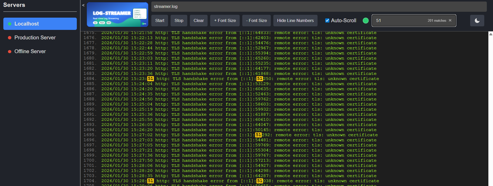

The frontend is a React application that provides a web interface for viewing log streams from the backend agent. It allows users to see a list of available log files and select one to view its content in real-time.



## Requisites

- **Node.js**
- **pnpm** (tested on v10.24.0)

## Configuring the Backend Host

The frontend needs to know the address of the backend agent to connect to. This can be configured at runtime:

-   **By default**, the application will try to connect to `http://localhost:5005`.
-   **To override the default**, you can specify a different address using the `host` query parameter in the URL.

The application ensures the URL has a valid schema (e.g., `http://`).

**Example:**

To connect to a backend agent running on `192.168.1.100:8080`, you would use the following URL:

```
http://<your-frontend-address>/?host=192.168.1.100:8080
```

## Managing the Server List

For environments with multiple backend agents, you can enable a server selection panel.

### Configuration

The server list is managed by the `frontend/public/servers.json` file. You can edit this file to add, remove, or modify your servers. The file should contain a JSON array of objects, where each object has a `name` and a `url`:

```json
[
  {
    "name": "Localhost",
    "url": "http://localhost:5005"
  },
  {
    "name": "Production Server",
    "url": "http://prod.server.example.com"
  }
]
```

### Behavior

-   **Side Panel:** If the `servers.json` file contains **more than one server**, a collapsible side panel will appear on the left, allowing you to switch between them. If there is only one server (or the file is missing), the panel will not be displayed.
-   **Default Server:** If the `host` query parameter is not present in the URL, the application will automatically use the **first server** from `servers.json` as the default connection.
-   **Status Check:** The panel will periodically check the `/alive` endpoint of each server and display a green dot for online servers and a red dot for offline ones.

## How to run for development

1.  **Install dependencies:**
    ```sh
    # If you have not installed packages before
    pnpm install
    ```
2.  **Start the development server:**
    ```sh
    # This runs the "start" script from package.json using react-scripts
    pnpm run start
    ```
The application will be available in development mode at `http://localhost:3000`.

## Build for production

To create an optimized static build of the application, run:
```sh
pnpm run build
```
The output will be placed in the `build` directory, ready for deployment.


## Testing
This project uses Jest and React Testing Library for unit tests. To run the tests, use the following command:

```sh
pnpm test
```

This will launch the test runner in interactive watch mode.

## TODO

* config to enable/disable autocomplete
* add config for list server
  * add right panel to show server list 
* clean up code
* add some tests
* add support for basic auth
* complete support for jwt token
* add config for protocol (https|http)
* add config for auth mode (none|basic|jwt)
* add support for dark/light theme